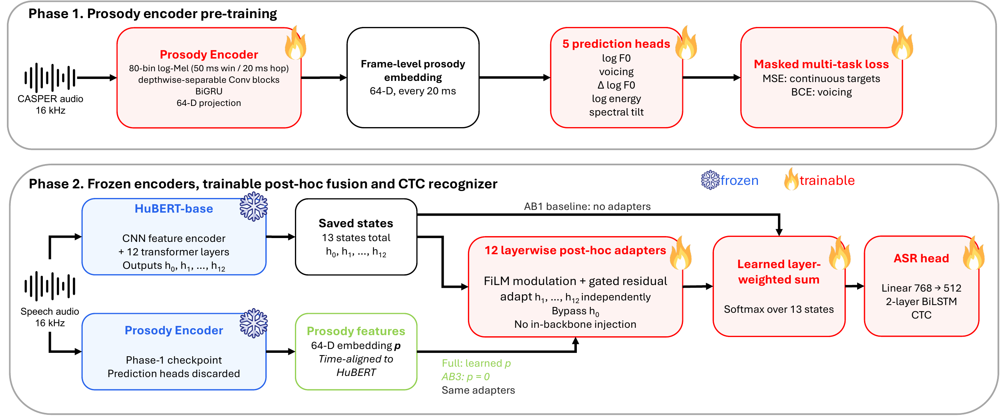

# Prosody or Adaptation?

Code and frozen result summaries for **“Prosody or Adaptation? Disentangling Gains in Frozen Self-supervised Learning Automatic Speech Recognition.”**

The project asks whether a prosody-trained auxiliary representation improves spontaneous-speech ASR beyond the trainable adaptation pathway required to use it. HuBERT remains frozen in every condition.

We compare three systems:

- **Baseline:** learned aggregation over frozen HuBERT states, with no post-hoc adapters.
- **Null:** the full adapter pathway, but its 64-D auxiliary input is fixed to zero throughout training and inference.
- **Learned:** the same parameter-matched adapter pathway supplied with a frozen 64-D prosody-trained representation.

The primary comparison is **Learned − Null**. This holds the adapter architecture and trainable parameter count fixed and changes only the auxiliary representation.

## Main result

| Corpus | Baseline | Null | Learned | Learned − Null | Null − Baseline |
|---|---:|---:|---:|---:|---:|
| Buckeye | 37.27 ± 0.10 | **35.82 ± 0.13** | 35.89 ± 0.11 | +0.07 | **−1.45** |
| Switchboard | 31.95 ± 0.09 | 31.24 ± 0.04 | **31.15 ± 0.07** | −0.09 | **−0.71** |
| AMI IHM | 39.11 ± 0.22 | **38.23 ± 0.22** | 38.23 ± 0.20 | +0.00 | **−0.88** |

WER values are percentages, averaged over three training seeds. The Learned − Null confidence intervals include zero for all three corpora, while Null significantly improves over Baseline on every corpus. The trained Learned models nevertheless depend on their auxiliary input: zeroing or mismatching it at test time degrades recognition. The paper therefore attributes the robust recognition gain to the **adaptation pathway**, while finding little measurable incremental WER benefit from the supplied representation under this architecture.

Full statistical summaries and post-hoc analyses are in [`results/RESULTS.md`](results/RESULTS.md).

## Architecture


HuBERT computes all thirteen states before fusion. The adapters operate on the saved transformer-layer outputs independently; modified states are **not** fed back into later HuBERT layers. See [`docs/ARCHITECTURE.md`](docs/ARCHITECTURE.md) for the two-phase view.

## Repository layout

```text
configs/      paper experiment, model, data, and teacher configurations
data/         public descriptors for licensed datasets
manifests/    frozen normalization and split hashes that can be redistributed
docs/         architecture, data, and reproducibility notes
results/      paper-facing aggregate results and machine-readable analyses
src/          training, inference, analysis, and data-preparation code
tests/        regression tests for the released pipeline
```

Development artifacts, smoke-test outputs, generated checkpoints, and per-utterance predictions are not included.

## Installation

Python 3.10 is recommended.

```bash
conda create -n prosody-adaptation python=3.10
conda activate prosody-adaptation
pip install -e '.[train,dev]'
pytest -q
```

For the CREPE-based target-extraction environment, see [`requirements-teacher.txt`](requirements-teacher.txt).

## Data

The repository does **not** redistribute corpus audio or transcripts. Buckeye, Switchboard, AMI, and CASPER must be obtained under their respective licenses or terms.

The checked-in descriptors preserve the frozen hashes and split sizes used in the paper. See [`LICENSED_DATA.md`](LICENSED_DATA.md) and [`docs/DATA.md`](docs/DATA.md) for the expected local layout.

For Buckeye, regenerate the licensed manifest from your local corpus copy:

```bash
prosody-adaptation prepare buckeye \
  --raw-archive /path/to/buckeye/archive \
  --output data/buckeye_v2_1 \
  --config configs/data/buckeye_v2_1.yaml
```

The regenerated `data/buckeye_v2_1/manifest.jsonl` must match the SHA-256 stored in `data/buckeye_v2_1/FROZEN.json`.

## Reproducing the experiments

### Phase 1: prosody-trained encoder
```
export PROSODY_ADAPTATION_CASPER_ROOT=/path/to/CASPER/teacher_cache
prosody-adaptation train-prosody --config configs/experiment/prosody_casper.yaml
```
Phase 1 predicts five frame-level targets: log F0, voicing, Δlog F0,
log energy, and spectral tilt. Only the 64-D hidden representation
before the prediction heads is used in Phase 2.

#### Pretrained Phase-1 checkpoint

The Phase-1 prosody encoder checkpoint used in the reported Phase-2
experiments is available on
[Hugging Face](https://huggingface.co/Ki-Woong95/prosody-adaptation-encoder).

The released checkpoint is the original experimental artifact and is
provided without modification. It was produced with an earlier version
of the Phase-1 implementation. The model architecture is unchanged,
but some parameter names differ from those in the current source tree.

Representative mappings include:

| Released checkpoint | Current implementation |
| --- | --- |
| `encoder.input_proj.*` | `encoder.input_projection.*` |
| `encoder.cnn.*` | `encoder.convolution.*` |
| `encoder.bigru.*` | `encoder.recurrent.gru.*` |
| `encoder.out_proj.*` | `encoder.output_projection.*` |
| `f0_head.*` | `heads.log_f0.*` |
| `delta_f0_head.*` | `heads.delta_log_f0.*` |
| `energy_head.*` | `heads.energy.*` |
| `tilt_head.*` | `heads.tilt.*` |

Accordingly, the released checkpoint should not be passed directly to
the current model with a strict `load_state_dict()` call without first
remapping the legacy parameter names. The original checkpoint, training
configuration, and SHA-256 checksum are preserved on Hugging Face for
provenance and reproducibility.

### Phase 2: ASR

Run one condition directly:

```bash
export PROSODY_ADAPTATION_BUCKEYE_CACHE=/path/to/buckeye_cache
prosody-adaptation train-asr --config configs/experiment/buckeye_learned_seed1.yaml
```

The full paper matrix contains 27 runs: 3 corpora × 3 conditions × 3 seeds. Config filenames use the paper-facing condition names `baseline`, `null`, and `learned`.

### Aggregate results and inference

After the registered runs are available under `outputs/`:

```bash
prosody-adaptation summarize-results
prosody-adaptation infer
prosody-adaptation analyze-features
prosody-adaptation infer-interventions
prosody-adaptation analyze-residuals
prosody-adaptation evaluate-prosody-transfer \
  --checkpoint outputs/phase1/casper_prosody_encoder_seed1/checkpoint_best.pt
```

The run registry is [`configs/results/paper_runs.yaml`](configs/results/paper_runs.yaml). Statistical inference uses paired test predictions with hierarchical Poisson bootstrap resampling and Holm correction as described in the paper.

## Notes

- HuBERT and the Phase-1 encoder remain frozen during Phase 2.
- Null and Learned have the same adapter architecture and trainable parameter count.
- The auxiliary sequence is resampled **per utterance** to the corresponding HuBERT frame length before fusion.
- Test-time interventions on a trained Learned model are diagnostics of model dependence; they are not substitutes for the parameter-matched Null training condition.
