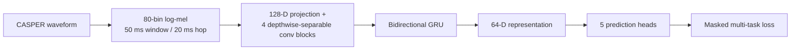
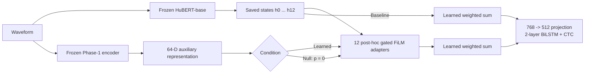

# Architecture

The released system follows the final paper: a prosody-trained encoder is learned in Phase 1, frozen, and then used only as an auxiliary input to post-hoc adapters in Phase 2.

## Phase 1

The heads predict log F0, voicing, Δlog F0, log energy, and spectral tilt. They are discarded after Phase 1; Phase 2 receives the 64-D hidden representation.

## Phase 2

HuBERT produces all hidden states before any adapter is applied. Each transformer-layer state is modified independently, so adapted layer `l` is not fed into HuBERT layer `l+1`. This is **post-hoc layerwise fusion**, not in-backbone injection.

### Conditions

- **Baseline (AB1):** no adapters.
- **Null (AB3):** all twelve adapters are present, but the auxiliary input is fixed to zero.
- **Learned (Full):** the same adapters receive the frozen 64-D representation.

Only Null and Learned are parameter matched. The Learned−Null contrast isolates the incremental value of the auxiliary representation; Null−Baseline measures the effect of adding the trainable adaptation pathway.

### Adapter

For a frozen HuBERT state `h` and aligned auxiliary representation `p`, each adapter computes FiLM parameters from normalized `p`, forms a candidate state, predicts a residual gate, and adds the gated residual to `h`. The learned residual scale is initialized at zero, so the module starts as an exact identity mapping.
